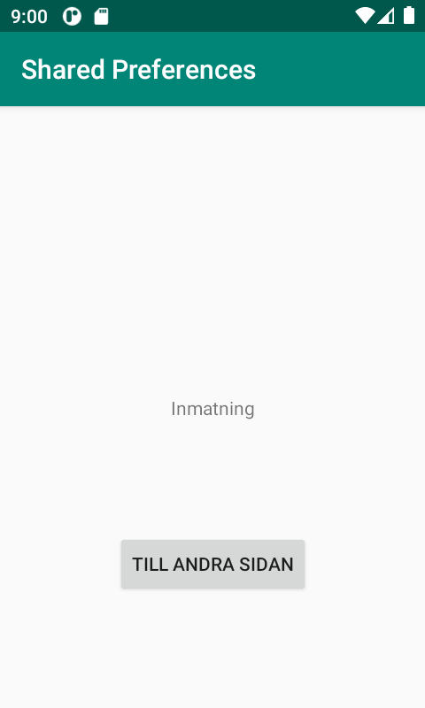
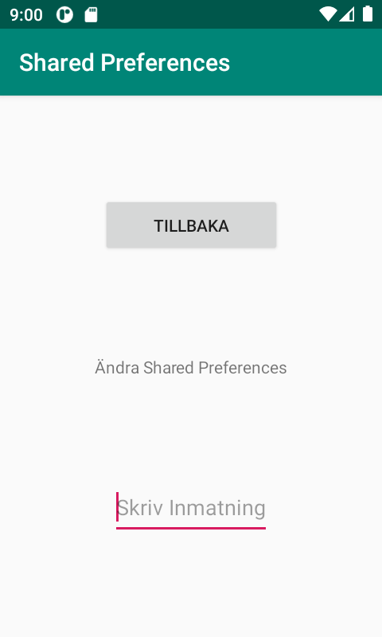

# Rapport

För en start valde jag att få båda aktiviteterna att fungera med knappar som leder mellan 
dem, detta blev väldigt likt det vi skulle göra i tidigare uppgiften screens. Jag använde
finish i secondactivity för att kunna aktivera onResume när jag går från secondActivity 
till mainActivity.

Jag valde sedan att göra koden för att skicka en input från secondActivity till shared 
preferances innan med en string och shared preferances editor för att använda editText 
getText och putString. 

public void onClick(View view) {
    SharedPreferences sharedPreferences = getSharedPreferences("my_preferences", Context.MODE_PRIVATE);
    SharedPreferences.Editor editor = sharedPreferences.edit();
.
    EditText editText = findViewById(R.id.editText);
    String inputValue = editText.getText().toString();
.
    editor.putString("inputKey", inputValue);
    editor.apply();
.
    finish();
}

Slutligen tog jag datan jag hade sparat med hjälp av en nyckel för shared preferances
visade jag upp den i en vanlig textView

@Override
protected void onResume() {
    super.onResume();
    SharedPreferences sharedPreferences = getSharedPreferences("my_preferences", Context.MODE_PRIVATE);
    String displayValue = sharedPreferences.getString("inputKey", "Shared Pref");
    TextView textView = findViewById(R.id.textView);
    Log.d("efter", String.valueOf(displayValue));
    textView.setText(displayValue);
}

